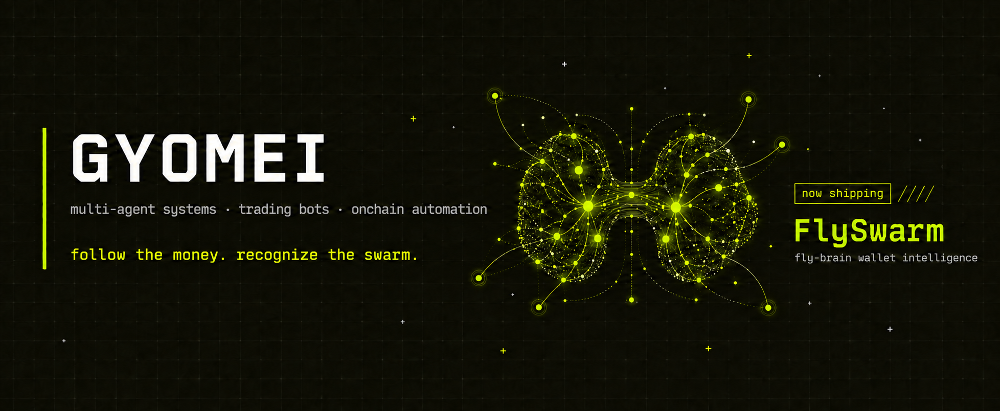
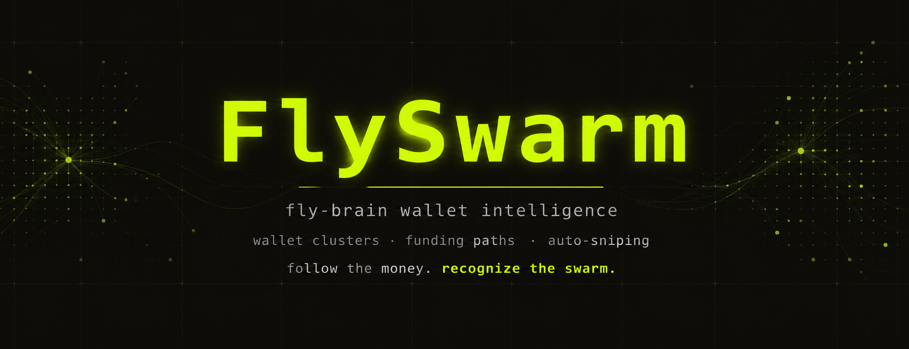
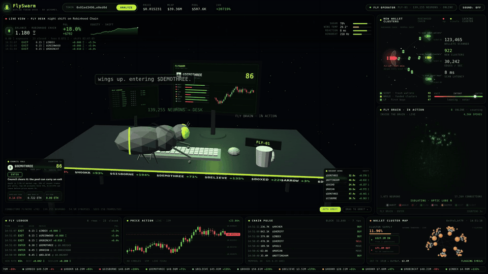

<p align="center">
  
</p>

<p align="left">
  <a href="https://x.com/Gyome1_"></a>
  <a href="https://github.com/semkazz1?tab=followers"></a>
  
</p>

## About me

```js
const gyomei = {
  builds:  ["wallet intelligence", "trading bots", "onchain automation"],
  tracks:  ["profitable wallets", "funding paths", "returning cohorts"],
  now:     "FlySwarm — fly-brain wallet intelligence",
  thesis:  "wallets move alone; groups leave a pattern",
  mode:    "build in public",
};
```

## Stack


## What I work on

| Area | What it means in practice |
|---|---|
| Funding graphs | follow transfers from profitable wallets into newly funded addresses |
| Cohort detection | recognize when a familiar group of wallets converges on the same meme again |
| Historical context | compare the group with its previous joint entries and outcomes |
| Automated execution | turn qualified signals into configurable auto-sniping rules |

## Now shipping

<p align="center">
  
</p>

Fresh addresses are cheap. Recurring groups are harder to hide.

Inspired by the digitized fly brain described in 2023 connectome research,
FlySwarm watches how profitable-wallet capital moves into fresh addresses.
It detects when a familiar group begins converging on the same meme again,
then returns the funding paths, the group's previous joint entries and an
explainable signal the user can connect to configurable auto-sniping.

<p>
  <a href="https://github.com/semkazz1/FlySwarm"></a>
  <a href="./assets/flyswarm-terminal-1080p60.mp4"></a>
</p>

<p align="center">
  
</p>


### How the signal forms

| 01 — Watch | 02 — Trace | 03 — Recognize | 04 — Act |
|---|---|---|---|
| follow proven wallets | rebuild funding chains into fresh addresses | match a returning group around one meme | alert or apply the user's auto-snipe rules |

Each signal keeps the evidence attached: source wallets, transfers, cluster
history, previous group outcomes and the exact rule that caused the alert.

<p>
  <a href="https://x.com/Gyome1_"></a>
</p>

> A wallet can hide behind a fresh address. A recurring group is harder to hide.

---

<sub>building systems that become more interesting together.</sub>
